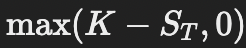

# Option Pricing Models

This project is an interactive Streamlit application showcasing various mathematical models used for option pricing. The app allows users to input key parameters, visualize results, and compare outputs from different models.

## Features

- **Interactive Input Interface**: Set parameters such as current asset price, strike price, volatility, risk-free rate, time to maturity, and more.
- **Implemented Models**:
  - Black–Scholes Model
  - Binomial Option Pricing Model (BOPM)
  - Cox-Ross-Rubinstein (CRR) Model
  - Monte Carlo Simulation for Option Pricing
- **Visualizations**:
  - Option price heatmaps
  - Distribution of simulated asset prices
- **Dynamic Result Display**: Outputs option prices for both call and put options, calculated using each model.

---

## Models

### 1. **Black–Scholes Model**
The Black–Scholes model is used to price European options. It assumes constant volatility and interest rates and uses a lognormal distribution for the asset price.

#### Call Option Formula:


#### Put Option Formula:


Where:


### 2. **Binomial Option Pricing Model (BOPM)**
The binomial model values options by iteratively working backwards through a recombining tree of possible asset prices. It calculates the option price at each step based on risk-neutral probabilities.

#### Parameters:
- Up factor: 
- Down factor: 
- Risk-neutral probability: 

#### Backward Induction:


### 3. **Cox-Ross-Rubinstein (CRR) Model**
The CRR model is a specific implementation of the binomial model with recombining trees. The asset price follows a multiplicative up and down movement, making the tree computationally efficient.

#### Steps:
1. Calculate the risk-neutral probability, \( p \).
2. Compute terminal payoffs (call/put).
3. Use backward induction to derive the option price at the initial node.

The equations are identical to the binomial model but emphasize consistent up/down factors: .

### 4. **Monte Carlo Simulation**
Monte Carlo simulation involves simulating the potential future prices of the underlying asset using a stochastic process, then calculating the expected payoff.

#### Stochastic Process:

Where Z is a standard normal random variable.

#### Expected Payoff:
- Call Option: 
- Put Option: 

Discount the average payoff to present value:


---

## Application Workflow

### Inputs
Users provide the following parameters via the sidebar:
- **Current Asset Price (S)**: Initial price of the underlying asset.
- **Strike Price (K)**: Price at which the option can be exercised.
- **Volatility (\( \sigma \))**: Annualized standard deviation of the asset's return.
- **Risk-Free Interest Rate (r)**: Annualized risk-free interest rate.
- **Time to Maturity (T)**: Time until the option expires.
- **Number of Simulations (for Monte Carlo)**: Number of random paths for simulation.
- **Number of Steps (for Binomial/CRR)**: Granularity of the binomial tree.

### Outputs
1. **Option Prices**:
   - Prices for call and put options are displayed for all models.
   - Results are shown as color-coded buttons (green for call, red for put).

2. **Visualizations**:
   - Heatmaps: Option prices as a function of spot price and volatility.
   - Simulated Price Distributions: Histograms of simulated prices at maturity for Monte Carlo.

---

## Visualizations

### Heatmaps
Heatmaps are generated for call and put prices using the Black–Scholes model. The x-axis represents the spot price, and the y-axis represents volatility.

### Distribution of Simulated Prices
Histograms are generated for Monte Carlo simulations, showing the distribution of asset prices at maturity with markers for the strike price.

---

## Installation and Usage

1. Clone the repository:
   ```bash
   git clone https://github.com/your-repo/option-pricing
   cd option-pricing
   ```

2. Install dependencies:
   ```bash
   pip install streamlit numpy scipy matplotlib seaborn
   ```

3. Run the app:
   ```bash
   streamlit run app.py
   ```

4. Open the app in your browser and interact with the models.

---

## Future Enhancements

- Add support for American options.
- Incorporate Greeks calculation (Delta, Gamma, etc.).
- Extend Monte Carlo to include variance reduction techniques.
